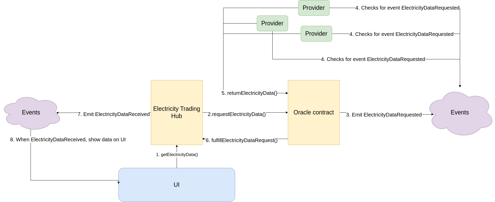

<!-- Improved compatibility of back to top link: See: https://github.com/othneildrew/Best-README-Template/pull/73 -->
<a name="readme-top"></a>

<!-- TABLE OF CONTENTS -->
<details>
  <summary>Table of Contents</summary>
  <ol>
    <li>
      <a href="#about-the-project">About The Project</a>
    </li>
    <li>
      <a href="#about-the-project">Architecture</a>
    </li>
    <li>
      <a href="#getting-started">Getting Started</a>
      <ul>
        <li><a href="#prerequisites">Frontend</a></li>
        <li><a href="#installation">Oracle</a></li>
        <li><a href="#installation">Smart Contract</a></li>
      </ul>
</details>


<!-- ABOUT THE PROJECT -->
## About The Project

The project is about facilitating electricity trading on the blockchain.
By providing a solution to participate in an (Vickrey) auction, market participants
can exchange monetary values to get the eligibility to conusme electrictty from the grid.
Additionally, a premium is send to all electricity providers which are considered renewable.
The premium is to incentivize electricty providers to invest in renewable energy sources to collect 
this monetary value in addition to the auction price. Conusmer are oblivious of this premium which varies 
depending on the energy mix in the grid. This will lead to a transformation in the energy production which will in long
term lead to net zero emissions in the energy production and the premium will converge to 0.

### Architecture


<!-- GETTING STARTED -->
## Getting Started

How to run the project locally on your laptop

### Prerequisites

In order to run the project on your laptop locally, you first have to follow the subsequent installation instructions:
* Go to the folder `energy-market/client` and run the following command from there to install the dependencies for the React frontend.
  ```sh
  npm install
  ```
* Go to the folder `energy-market/oracleServer` and run the following command from there to install the dependencies for the oracle.
  ```sh
  npm install hardhat
  ```

### How to run 
In order to run the project on your laptop locally, you have to follow the subsequent execution instructions:
* Go to the folder `energy-market/oracleServer` and run the following commands from there to start the oracle
1. In order to start the oracle server, run the following command:
```
node frontend.js
```
2. In order to start the oracle provider, run the following command:
```
npx hardhat run provider --network sepolia 
```
* Go to the folder `energy-market/client` and run the following command from there to run the React frontend.
  ```sh
  npm start
  ```
### Smart Contract 



Currently for our project, we are using Hardhat as the ethereum development environment. For the development purpose, we are using the sepolia testnet. Everything is automated and already configured through hardhat config files to deploy to the testnet.

All the following commands needs to be executed from the `energy-market/smart-contracts` folder.
- In order to compile your smart contracts:
```sh
 npx hardhat compile
```
- In order to deploy your smart contracts:
```
npx hardhat run scripts/deploy.js --network sepolia

```
- Next, you have to update the `oracleServer/provider/electricityDataOracleABI.json` and `oracleServer/frontend/callerABI.js` with the new ABI generated after the deployment. It can be found here: `smart-contracts/artifacts/contracts/energyContracts/`

- Update the new contract address in `energy-market/oracleServer/provider/index.js` and `energy-market/oracleServer/frontend/app.js`


